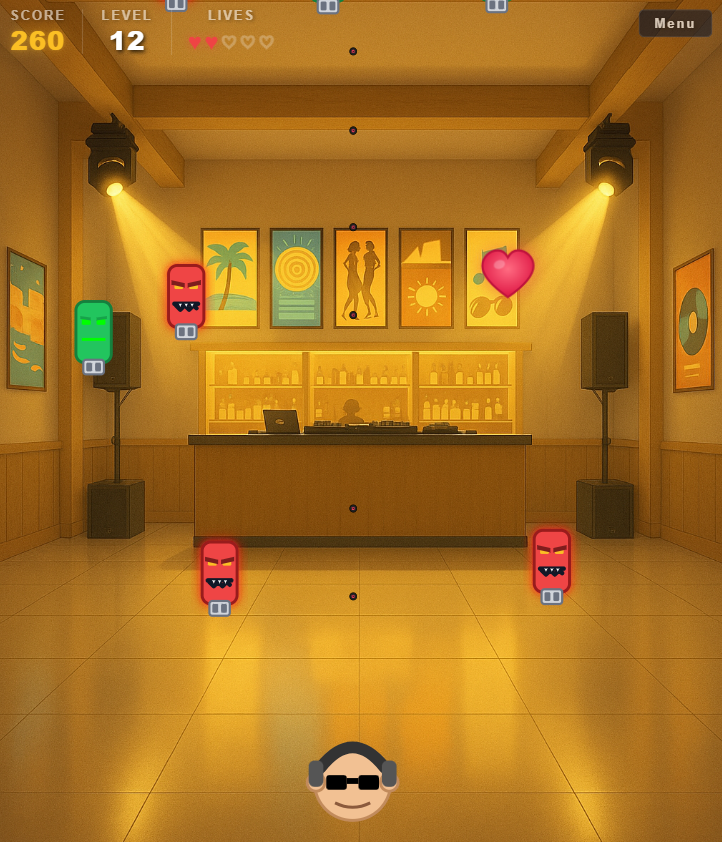

# Dancefloor Defender

Retro arcade shooter built from scratch with vanilla JavaScript.
Defend the nightclub dancefloor from waves of bad DJs, shoot vinyl records and survive.

**Live Demo:** [wai-coding.github.io/dancefloor-defender](https://wai-coding.github.io/dancefloor-defender/)  
**Repository:** [github.com/wai-coding/dancefloor-defender](https://github.com/wai-coding/dancefloor-defender)  
**LinkedIn:** [linkedin.com/in/luiscastrocoding](https://www.linkedin.com/in/luiscastrocoding/)

## Gameplay Highlights

- Progressive difficulty with arcade-style ramp from Level 5
- Multiple enemy types (standard + 3-hit Angry with zigzag movement)
- Risk/reward Heart power-up (shoot it and lose a life)
- Persistent Top 10 leaderboard via localStorage
- Touch-friendly mobile controls
- Dark/light theme and audio preferences saved between sessions

## Controls

**Keyboard**

- `← →` Move
- `Space` Shoot
- `P` Pause
- `M` Mute / Unmute
- `L` Dark / Light mode

**Mobile**

- Left third: Move left
- Right third: Move right
- Center: Shoot
- Menu button: Pause

## Tech Stack

- Vanilla JavaScript (ES6 classes, no frameworks)
- HTML5 + CSS3
- GitHub Pages

Built as part of my frontend / JavaScript portfolio.

Responsive gameplay tested across desktop, mobile and tablet.